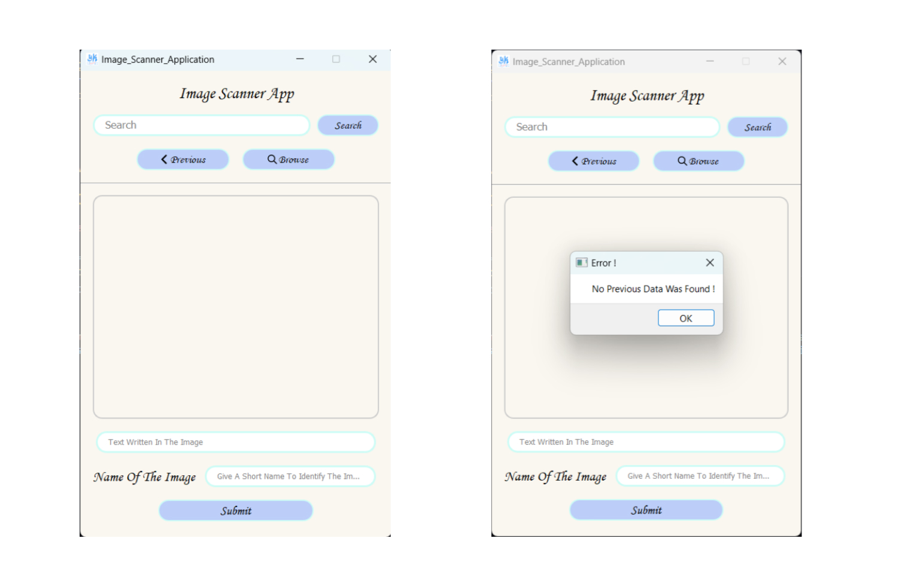
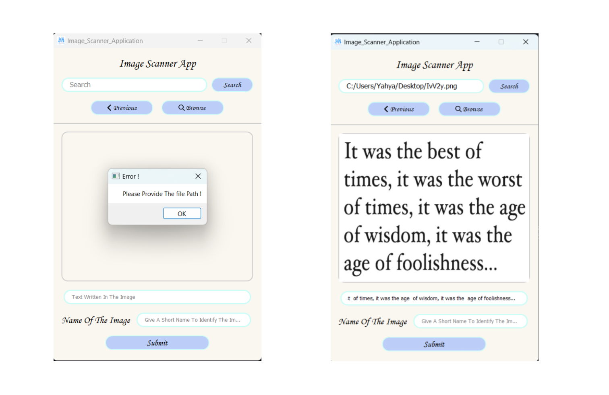
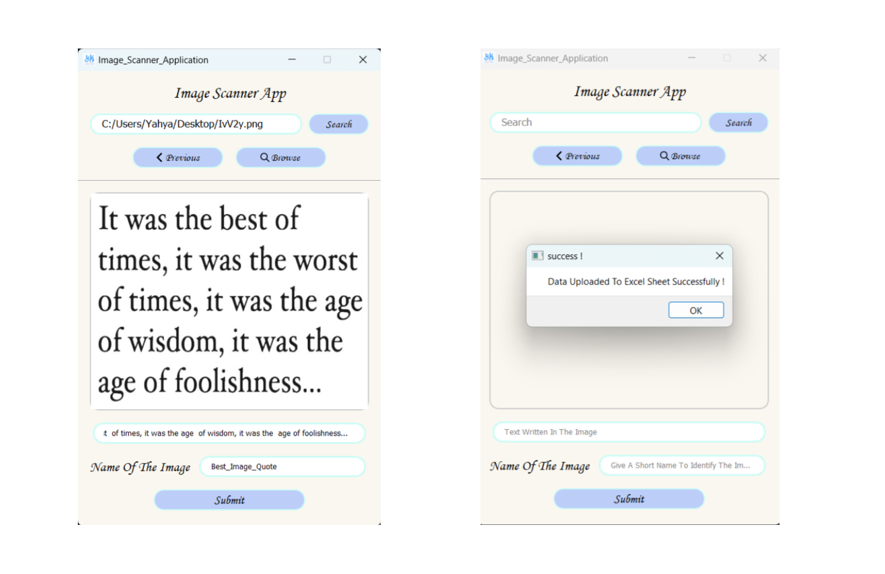
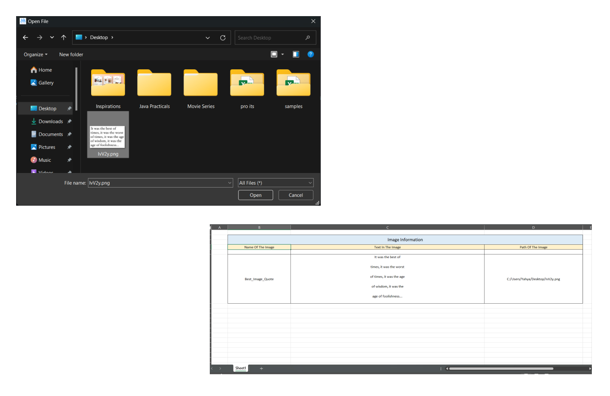

# Image Scanner App

This is my attempt to create a image scanner app which allows user to get the text scanned out of image using any image and with additional functionality like it have a browse button by which user can directly locate the image he want to scan or he can provide the path to it and can show the previous records as well using openpyxl and storing data in excel file.

## Scrennshots

